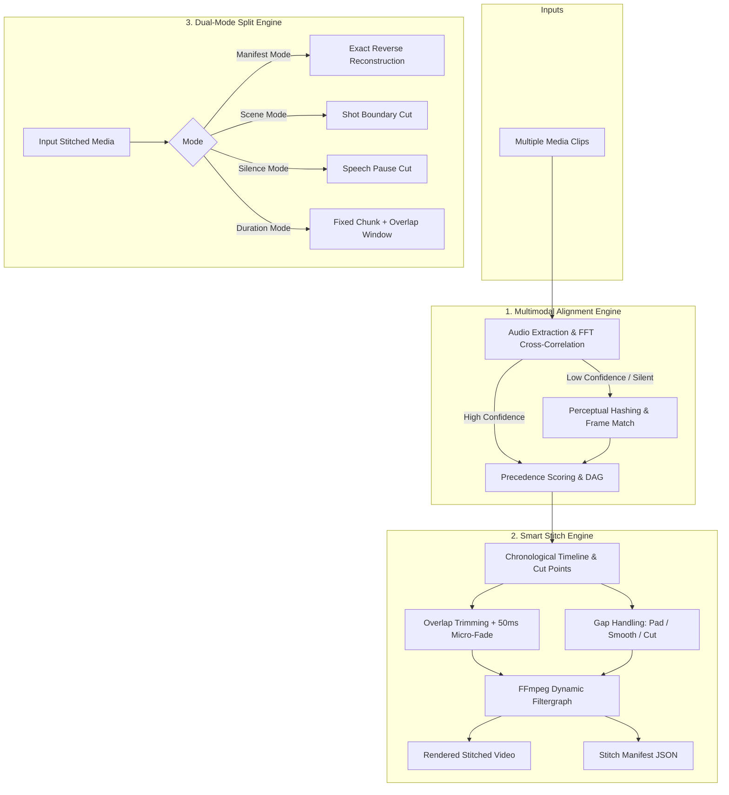

# Stitch-Media 🎞

<div align="center">

[](https://github.com/red352/stitch-media/actions/workflows/ci.yml)
[](https://www.python.org/)
[](https://opensource.org/licenses/MIT)
[](https://ffmpeg.org/)
[](https://github.com/psf/black)

**Intelligent media stitch & split toolkit with multimodal adaptive alignment, smooth overlap blending, and gap compensation.**

[English](#features) | [中文说明](#中文文档)

</div>

---

## Features

- ⚡ **Lossless Smart Stream Copy (`-c copy`)**: When merging contiguous clips with matching codecs/resolutions (such as split movies or livestream recordings), stitch-media performs ultra-fast direct stream copying via the concat demuxer in seconds with 0% CPU consumption and 0% quality loss.
- 🚀 **Boundary Sliding Window & Timecode Fast-Path**: Eliminates gigabyte audio extractions on multi-hour media by sampling 120s boundary windows and recognizing standardized timecode patterns (`HH_MM_SS_mmm`).
- 🎧 **Multimodal Adaptive Alignment**: Combines sub-millisecond FFT normalized cross-correlation (NCC) on acoustic energy with video perceptual hashing (dHash/pHash) and visual difference fallback.
- 🔀 **Autonomous Sequence Ordering**: Pass disordered or shuffled clips in any order (`part3.mp4`, `part1.mp4`, `part2.mp4`); the tool builds a precedence DAG to discover the true chronological timeline automatically.
- ✂ **Smart Overlap Trimming & Audio Smoothing**: Detects overlapping intervals, micro-trims duplicate frames cleanly, and applies 50ms micro-crossfades to eliminate audio clicks and phase cancelation.
- ⏱ **Flexible Gap Strategies**: If frames or time segments are missing, choose between `--gap-strategy pad` (insert synthetic black video & silence to preserve physical timeline), `smooth` (subtle dissolve transition), or `cut`.
- 🔁 **Dual-Mode Media Splitting**:
  - **Manifest Reverse Mode**: Read `manifest.json` from a previous stitch to reconstruct the exact original clips (including original overlaps).
  - **Autonomous Splitting**: Split video based on visual scene transitions (`--mode scene`), speech pauses (`--mode silence`), or fixed duration with overlap windows (`--mode duration`).
- ⚡ **GPU Hardware Acceleration**: Autodetects NVIDIA NVENC (`h264_nvenc`), Intel QSV (`h264_qsv`), and Apple VideoToolbox, falling back to CPU `libx264` when re-encoding is necessary.
- 📊 **Rich CLI & Dry Run**: Beautiful terminal tables, progress bars, and `--dry-run` inspection mode.

---

## Architecture



---

## Installation & Execution

### Prerequisites
- Python 3.10 or higher
- [FFmpeg](https://ffmpeg.org/download.html) installed and available on your system `PATH`.

### Setup with `uv` (Recommended)
```bash
# Clone the repository
git clone https://github.com/red352/stitch-media.git
cd stitch-media

# Sync dependencies into local virtual environment (.venv)
uv sync
```

### How to Run the CLI
Because `uv sync` installs into an isolated virtual environment (`.venv/`), choose any of the three ways to run:

#### Option 1: Via `uv run` (Zero Activation, Recommended)
```bash
uv run stitch-media --help
uv run stitch-media version
uv run stitch-media join clip1.mp4 clip2.mp4 -o out.mp4
```

#### Option 2: Activate Virtual Environment
- **Windows (PowerShell)**:
  ```powershell
  .venv\Scripts\activate
  stitch-media --help
  ```
- **Linux / macOS**:
  ```bash
  source .venv/bin/activate
  stitch-media --help
  ```

#### Option 3: Install Globally as a System CLI Tool
Install directly into uv's global tool directory so you can invoke `stitch-media` from **any** directory without navigating to the repo:
```bash
uv tool install .
# Now available globally:
stitch-media --help
```

---

## Quick Start CLI

### 1. Stitch multiple clips together
```bash
# Automatically detects order, trims overlaps, and stitches into out.mp4
uv run stitch-media join part2.mp4 part1.mp4 part3.mp4 -o out.mp4

# Preview timeline and overlap metrics without encoding (dry run)
uv run stitch-media join clipA.mp4 clipB.mp4 -o out.mp4 --dry-run

# Handle missing gaps with smooth crossfade rather than black frame padding
uv run stitch-media join clip1.mp4 clip2.mp4 -o out.mp4 --gap-strategy smooth
```

### 2. Inspect clips before stitching
```bash
uv run stitch-media inspect clipA.mp4 clipB.mp4 clipC.mp4
```

Output:
```
                🔍 Media Sequence & Alignment Analysis
┏━━━━━━━┳━━━━━━━━━━━━━━┳━━━━━━━━━━┳━━━━━━━━━━━━━━━━━━━┳━━━━━━━━━━━━━━━━━━━┳━━━━━━━━━━━━┓
┃ Order ┃ Filename     ┃ Duration ┃ Transition Method ┃ Overlap with Next ┃ Confidence ┃
┡━━━━━━━╇━━━━━━━━━━━━━━╇━━━━━━━━━━╇━━━━━━━━━━━━━━━━━━━╇━━━━━━━━━━━━━━━━━━━╇━━━━━━━━━━━━┩
│ 1     │ part1.mp4    │ 12.50s   │ audio             │ 2.30s             │ 98.4%      │
│ 2     │ part2.mp4    │ 15.00s   │ audio             │ 1.15s             │ 95.2%      │
│ 3     │ part3.mp4    │ 10.00s   │ -                 │ -                 │ -          │
└───────┴──────────────┴──────────┴───────────────────┴───────────────────┴────────────┘
```

### 3. Split media (Reverse or Autonomous)

**Reverse reconstruction using manifest:**
```bash
uv run stitch-media split out.mp4 --mode manifest --manifest out.manifest.json -o ./restored_clips/
```

**Autonomous split by visual scenes:**
```bash
uv run stitch-media split presentation.mp4 --mode scene --scene-threshold 0.35 -o ./shots/
```

**Autonomous split by speech silence:**
```bash
uv run stitch-media split podcast.mp4 --mode silence -o ./speech_segments/
```

**Split by fixed duration with overlap window:**
```bash
# Split into 60-second chunks with a 5-second overlap window
uv run stitch-media split long_video.mp4 --mode duration --duration 60 --overlap 5 -o ./chunks/
```

---

## Python API Usage

You can also use `stitch-media` as a Python library:

```python
from pathlib import Path
from stitch_media import MediaStitcher, StitchConfig, GapStrategy

config = StitchConfig(
    output_path=Path("final.mp4"),
    gap_strategy=GapStrategy.PAD,
    hardware_accel=True,
)

stitcher = MediaStitcher(config)
manifest = stitcher.stitch(["part2.mp4", "part1.mp4"])
print(f"Stitched {len(manifest.segments)} segments! Total duration: {manifest.total_duration}s")
```

---

## Manifest Specification (`manifest.json`)

When stitching, a `.manifest.json` file is produced recording full reproducibility metadata:

```json
{
  "version": "1.0",
  "created_at": "2026-09-05T15:40:00.000000+00:00",
  "output_filename": "out.mp4",
  "total_duration": 34.05,
  "gap_strategy": "pad",
  "segments": [
    {
      "segment_id": 0,
      "source_path": "clip1.mp4",
      "source_filename": "clip1.mp4",
      "original_duration": 15.0,
      "trim_start": 0.0,
      "trim_end": 15.0,
      "trimmed_duration": 15.0,
      "output_start": 0.0,
      "output_end": 15.0,
      "overlap_with_next": 2.15,
      "gap_to_next": 0.0
    }
  ]
}
```

---

<a name="中文文档"></a>
## 中文说明

`stitch-media` 是一个遵循工程化最佳实践构建的智能音视频拼接与拆分工具。

### 核心亮点
1. **智能极速无损流拷贝（Smart Stream Copy `-c copy`）**：对编码、分辨率与帧率一致且无重叠的连续分割片段（如电影分段、录播切片），自动切换至 Concat Demuxer 零转码直出，数秒完成数 GB 视频合并，CPU 与画质 0 损耗。
2. **长视频边界滑动窗口与时间戳快路径**：针对数小时长视频引入首尾 120s 边界滑动窗口提取，并内置常见标准化文件名时间戳（`HH_MM_SS_mmm`）直接对齐，彻底避免全量提取数十兆采样点导致的内存高占用与卡顿。
3. **多模态自适应对齐**：使用音频归一化 FFT 互相关计算毫秒级重叠与偏移量；在静音或低置信度场景下自动结合视频差分感知哈希（pHash）与帧匹配。
4. **自动时序推导**：支持输入乱序片段，算法自动计算两两关联并基于拓扑路径识别原始先后顺序。
5. **平滑融合**：精细裁切重叠画面，音频过渡注入毫秒级淡入淡出彻底消除破音；支持间隙（丢失片段）黑帧补齐或平滑过渡。
6. **双模逆向/自主拆分**：支持基于 `manifest.json` 无损反向还原原片段；支持场景镜头检测、静音停顿检测以及定长重叠窗自主拆分。
7. **现代 CLI 与架构**：基于 Typer 与 Rich 构建，支持 `--stream-copy`、`--boundary-window`、`--dry-run` 预览与 GPU 硬件加速。

### 运行方式说明

在使用 `uv sync` 完成依赖同步后，程序可执行文件位于当前项目的独立虚拟环境 `.venv\` 中。推荐以下 3 种使用方式：

#### 方式 1：通过 `uv run` 执行（推荐，无需手动激活环境）
```bash
# 查看帮助
uv run stitch-media --help

# 智能拼接（自动识别先后顺序与消除重叠）
uv run stitch-media join part2.mp4 part1.mp4 -o final.mp4

# 查看对齐分析与重叠度（不进行视频转码）
uv run stitch-media inspect part1.mp4 part2.mp4
```

#### 方式 2：激活本地虚拟环境后直接执行
- **Windows (PowerShell)**:
  ```powershell
  .venv\Scripts\activate
  stitch-media --help
  stitch-media join part1.mp4 part2.mp4 -o final.mp4
  ```
- **Linux / macOS**:
  ```bash
  source .venv/bin/activate
  stitch-media --help
  ```

#### 方式 3：全局工具安装（在系统任意路径直接调用）
```bash
uv tool install .
```
安装后，在终端任何文件夹下输入 `stitch-media` 即可直接使用。

---

## Contributing

Contributions, issues, and feature requests are welcome!
Please check the [Issues page](https://github.com/red352/stitch-media/issues) or submit a Pull Request.

1. Fork the Project
2. Create your Feature Branch (`git checkout -b feature/AmazingFeature`)
3. Commit your Changes (`git commit -m 'feat: add some amazing feature'`)
4. Push to the Branch (`git push origin feature/AmazingFeature`)
5. Open a Pull Request

---

## License

Distributed under the MIT License. See [`LICENSE`](./LICENSE) for details.
